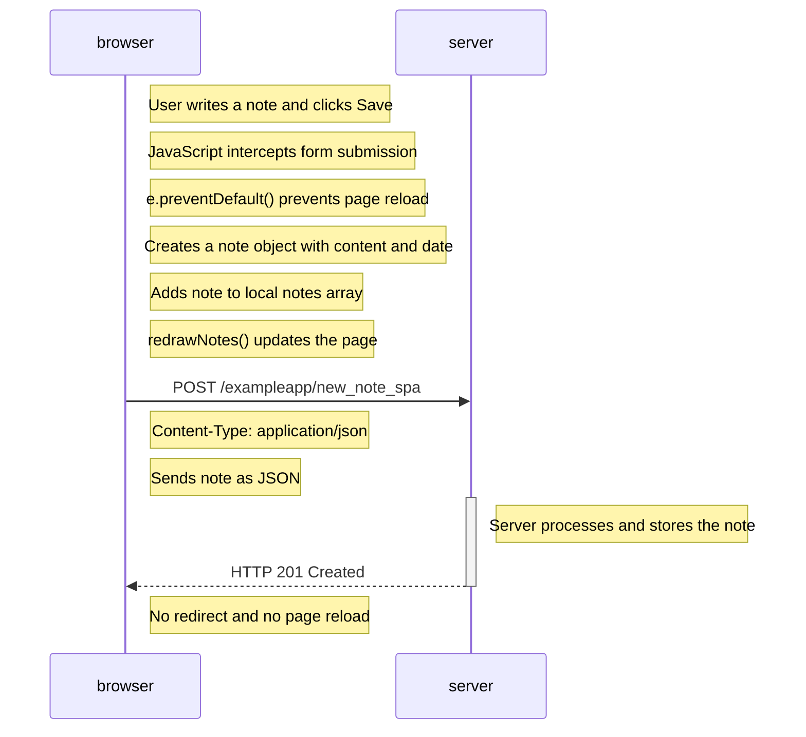

```mermaid
sequenceDiagram
    participant browser
    participant server

    Note right of browser: User writes a note and clicks Save

    Note right of browser: JavaScript intercepts form submission
    Note right of browser: e.preventDefault() prevents page reload

    Note right of browser: Creates a note object with content and date
    Note right of browser: Adds note to local notes array
    Note right of browser: redrawNotes() updates the page

    browser->>server: POST /exampleapp/new_note_spa
    Note right of browser: Content-Type: application/json
    Note right of browser: Sends note as JSON
    activate server

    Note right of server: Server processes and stores the note

    server-->>browser: HTTP 201 Created
    deactivate server

    Note right of browser: No redirect and no page reload
```
